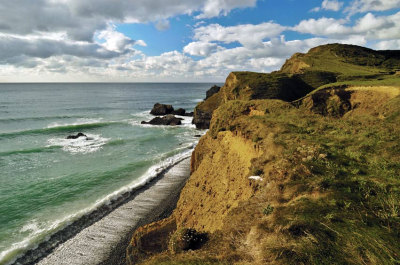

```{r setup, echo=FALSE}
knitr::opts_chunk$set(echo = TRUE)
#source('mapsassignment.R')
```

##  Bude ...

Is a small seaside resort town in north Cornwall, England, UK,  
in the civil parish of Bude-Stratton and at the mouth of the River Neet (also known locally as the River Strat). It is sometimes formerly known as Bude Haven.It lies southwest of Stratton, south of Flexbury and Poughill, and north of Widemouth Bay and is located along the A3073 road off the A39. Bude is twinned with Ergué-Gabéric in Brittany, France.Bude's coast faces Bude Bay in the Celtic Sea, part of the Atlantic Ocean. The population of the civil parish can be found under Bude-Stratton.


## Watermap for Bude


## **Roamap on Bude** 


##  There is a lot to love about Bude! 

With a laidback allure all of its own, and so much to see and do, we have something for everyone. From romantic whiskaways to fun-fuelled family holidays, it’s all here, where Cornwall begins and everyday cares melt away.  Bude has been named as the Best UK Coastal Resort for three consecutive years, winning a section of Gold, Silver and Bronze awards in the British Travel Awards. Below are some of the best locations for a vacation getway. 

##**The Bude Beaches**

When the tide is at its lowest, it is possible to take in the spectacular coastline between Bude and Sandymouth by walking the two miles along the beach. Returning by the coast path makes it a very pleasant, circular walk. Sandymouth is a National Trust beach and has a large, manned, car park with 200 spaces at the top of the cliff.



## Sea Pools are slightly warmer
Bude Sea Pool is a beautiful, part natural, part man-made swimming pool in the rocks at Summerleaze Beach. Created in 1930, the Sea Pool has provided safe bathing at Bude for over 80 years. It is one of the very few tidal swimming pools which still remains open to the general public today and is open throughout the year, free for all to enjoy. The Pool is topped up by the sea at high tide each day.


## Cricket by the Sea

Bude North Cornwall Cricket Club is situated on the clifftops overlooking the Atlantic Ocean, and is quite simply one of the most stunning locations you could ever wish to visit, let alone play cricket at!


